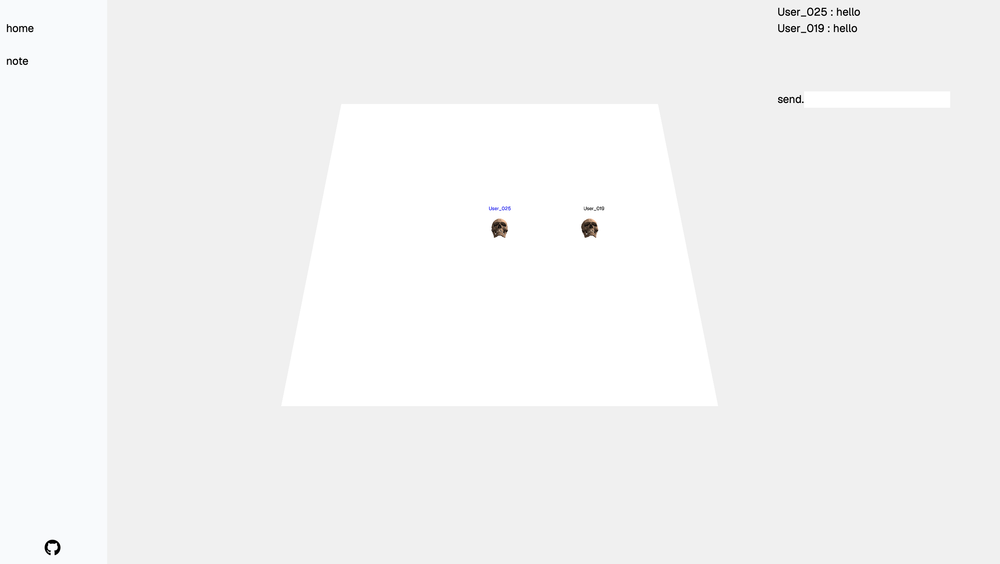
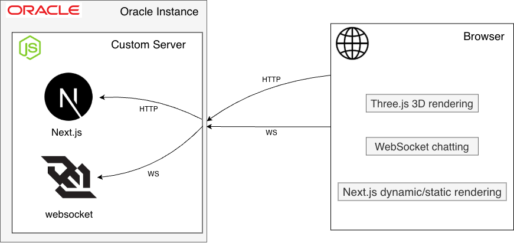

## Overview
**PSH** is a personal web platform designed as a **playground for my experimental web services**.  
It is a space where I design, test, and iterate on interactive web-based ideas.

## Screenshots 


http://168.107.4.85:3000/   

## Architecture

  
- **Next.js** was chosen because it allowed me to build both the frontend and server-side logic within a single full-stack framework.
- A **custom server** was introduced because the project required a dedicated **WebSocket server** for real-time communication.
- **Three.js** was used to render 3D graphics directly in the browser.

## Learnings
- Improved my understanding of **Next.js** by applying a **custom server** architecture.
- Learned how to implement real-time communication with a **WebSocket server** in **Node.js**.
- Built practical experience in browser-based **3D rendering** with **Three.js**.

## How to run
```
git clone https://github.com/clapppp/psh.git
cd psh/psh
npm ci
npm run dev
```
